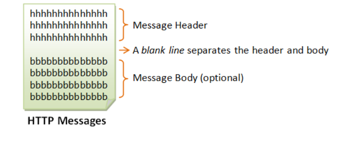

# HTTP(HyperText Transfer Protocol)

## Why we need HTTP?

- Internet or (the Web) is a massive distributed client/server information system.
- Many applications are running concurrently over the Web, such as web browsing/surfing, e-mail, file transfer, audio & video streaming, and so on.
- So, In order for **proper communication to take place between the client and the server**, these applications must agree on a specific application-level protocol such as HTTP, FTP, SMTP, POP, and etc.

## What is HTTP?

- HTTP (Hypertext Transfer Protocol) is perhaps the most popular application-level protocol used in the Internet (or The WEB).
- HTTP is an *asymmetric(one way communication) request-response client-server* protocol.
- An HTTP client sends a request message to an HTTP server.  The server, in turn, returns a response message.
- HTTP is a *pull protocol*, the client *pulls* information from the server (instead of server *pushes* information down to the client).
- HTTP is a stateless protocol. In other words, the current request does not know what has been done in the previous requests.
- HTTP permits negotiating of data type and representation

## What do the browser do when the client issue a URL?

1. Whenever you issue a URL from your browser to get a web resource using HTTP, e.g. `http://www.nowhere123.com/index.html`, the browser turns the URL into a *request message* and sends it to the HTTP server.
2.  The HTTP server interprets the request message, and returns you an appropriate response message, which is either the resource you requested or an error message. 

## what is URL ?

**Uniform Resource Locator —** 

is used to uniquely identify a resource over the web. 

- URL has the following syntax:

```
protocol://hostname:port/path-and-file-name
```

There are 4 parts in a URL:

1. *Protocol*: The application-level protocol used by the client and server, e.g., HTTP, FTP, and telnet.
2. *Hostname*: The DNS domain name (e.g., `www.nowhere123.com`) or IP address (e.g., 192.128.1.2) of the server.
3. *Port*: The TCP port number that the server is listening for incoming requests from the clients.
4. *Path-and-file-name*: The name and location of the requested resource, under the server document base directory.

For example, in the URL `http://www.nowhere123.com/docs/index.html`, 

1. the communication protocol is HTTP; 
2. the hostname is `www.nowhere123.com`.
3.  The port number was not specified in the URL, and takes on the default number, which is TCP port 80 for HTTP.
4.  The path and file name for the resource to be located is "`/docs/index.html`".

   

## What do the http protocol do when received a URL ?

- **In its idling state**, an HTTP server does nothing but **listening** to the **IP address(es) and port(s)** specified in the configuration for incoming request.    — When a request arrives, the server analyzes the message header, applies rules specified in the configuration, and takes the appropriate action —.

whenever you enter a URL in the address box of the browser, the browser translates the URL into a **request message** according to the specified protocol; and sends the request message to the server.

For example, the browser translated the URL `http://www.nowhere123.com/doc/index.html` into the following request message:

```
GET/docs/index.html HTTP/1.1
Host:www.nowhere123.com
Accept: image/gif, image/jpeg, */*
Accept-Language: en-us
Accept-Encoding: gzip, deflate
User-Agent: Mozilla/4.0 (compatible; MSIE 6.0; Windows NT 5.1)
(blank line)
```

When this request message reaches the server, the server can take either one of these actions:

1. The server interprets the request received, maps the request into a *file* under the server's document directory, and returns the file requested to the client.
2. The server interprets the request received, maps the request into a *program* kept in the server, executes the program, and returns the output of the program to the client.
3. The request cannot be satisfied, the server returns an error message.

An example of the HTTP response message is as shown:

```
HTTP/1.1 200 OK
Date: Sun, 18 Oct 2009 08:56:53 GMT
Server: Apache/2.2.14 (Win32)
Last-Modified: Sat, 20 Nov 2004 07:16:26 GMT
ETag: "10000000565a5-2c-3e94b66c2e680"
Accept-Ranges: bytes
Content-Length: 44
Connection: close
Content-Type: text/html
X-Pad: avoid browser bug

<html><body><h1>It works!</h1></body></html>
```

- The browser receives the response message, interprets the message and displays the contents of the message on the browser's window according to the media type of the response (as in the Content-Type response header). Common media type include "`text/plain`", "`text/html`", "`image/gif`", "`image/jpeg`", "`audio/mpeg`", "`video/mpeg`", "`application/msword`", and "`application/pdf`".

# Why Transport Protocols?

## HTTP and Transport Protocol(TCP/IP)

HTTP is a client-server application-level protocol and It typically **runs over** a TCP/IP connection.

 (HTTP needs **not** run on TCP/IP. It only presumes a reliable transport. Any transport protocols that provide such guarantees can be used.)

### IP (Internet Protocol) — is a network-layer protocol, deals with network addressing and routing.

- In an IP network, each machine is assigned an unique IP address (e.g., 165.1.2.3), and the IP software is responsible for routing a message from the source IP to the destination IP.
- In IPv4 (IP version 4), the IP address consists of 4 bytes, each ranges from 0 to 255, separated by dots, which is called a *quad-dotted form*.  This numbering scheme supports up to 4G addresses on the network.  The latest IPv6 (IP version 6) supports more addresses.
- The DNS (Domain Name Service) — Since memorizing number is difficult for most of the people, an english-like domain name, such as `www.nowhere123.com` is used instead.  **So**, translates the domain name into the IP address (via distributed lookup tables).
- A special IP address **127.0.0.1** always refers to your own machine.  It's domain name is "`localhost`" and can be used for *local loopback testing*.

### TCP (Transmission Control Protocol) — is a transport-layer protocol, responsible for establish a connection between two machines.

### **— TCP consists of 2 protocols:**

**TCP and UDP (User Datagram Package).**

- **TCP is *reliable*,** each packet has a sequence number, and an acknowledgement is expected.  A packet will be **re-transmitted** if it is not received by the receiver.  Packet delivery is guaranteed in TCP.
- TCP *multiplexes* applications within an IP machine. **For each IP machine, TCP supports (multiplexes) up to 65536 ports (or sockets)**, from port number 0 to 65535. ” An application, such as HTTP or FTP, runs (or listens) at a particular port number for incoming requests. Port 0 to 1023 are pre-assigned to popular protocols, e.g., HTTP at 80, FTP at 21, Telnet at 23, SMTP at 25, NNTP at 119, and DNS at 53.  Port 1024 and above are available to the users”.
- Although TCP port 80 is pre-assigned to HTTP, as the default HTTP port number, this does not prohibit you from running an HTTP server at other user-assigned port number (1024-65535) such as 8000, 8080, especially for test server. You could also run multiple HTTP servers in the same machine on different port numbers. When a client issues a URL without explicitly stating the port number, e.g., `http://www.nowhere123.com/docs/index.html`, the browser will connect to the default port number 80 of the host `www.nowhere123.com`. You need to explicitly specify the port number in the URL, e.g. `http://www.nowhere123.com:8000/docs/index.html` if the server is listening at port 8000 and not the default port 80.

---

- UDP does not guarantee packet delivery, and is therefore **not reliable.**  However, UDP has less network overhead and can be used for applications such as video and audio streaming, where reliability is not critical.

In brief,  TCP/IP (Transmission Control Protocol/Internet Protocol) is a set of transport and network-layer protocols for machines to communicate with each other over the network. 

And, to communicate over TCP/IP, you need to know 

(a) IP address or hostname, 

(b) Port number.

### HTTP Specifications(Types)

There are currently two versions of HTTP — HTTP/1.0 and HTTP/1.1.

- The original version, HTTP/0.9 (1991), written by Tim Berners-Lee, is a simple protocol for transferring raw data across the Internet.
- HTTP/1.0 (1996) (defined in RFC 1945), improved the protocol by allowing MIME-like messages.
- HTTP/1.0 **does not** address the issues of proxies, caching, persistent connection, virtual hosts, and range download. **These features were provided in HTTP/1.1** (1999) (defined in RFC 2616).

## How HTTP client and server communicate?

## HTTP Request and Response Messages

— HTTP client and server communicate by **sending text messages.** 

The client sends a *request message* to the server.  The server, in turn, returns a *response message*.

### Infrastructure of HTTP Messages—

An HTTP message consists of a

1. Message Header
2. A blank line separates the header and body 
3. Message Body (optional)



### HTTP Request Message

1. Request Message Header
2. A blank line separates the header and body 
3. Message Body (optional)

### Request Message Header consist of —

### **1. Request Line —**

The first line of the header is called the *request line*, followed by optional *request headers*.

The request line has the following syntax:

```
request-method-namerequest-URIHTTP-version
```

- *request-method-name*: HTTP protocol defines a set of request methods, e.g., GET, POST, HEAD, and OPTIONS. The client can use one of these methods to send a request to the server.
- *request-URI*: specifies the resource requested.
- *HTTP-version*: Two versions are currently in use: HTTP/1.0 and HTTP/1.1.

Examples of request line are:

```
GET /test.html HTTP/1.1
HEAD /query.html HTTP/1.0
POST /index.html HTTP/1.1
```

### 2. Request Headers — (optional)

The request headers are in the form of `name:value` pairs. Multiple values, separated by commas, can be specified.

```
request-header-name:request-header-value1,request-header-value2, ...
```

Examples of request headers are:

```
Host: www.xyz.com
Connection: Keep-Alive
Accept: image/gif, image/jpeg, */*
Accept-Language: us-en, fr, cn
```


### HTTP Response Message

1. Response Message Header (Status line, Response Header)
2. A blank line separates the header and body 
3. Message Body (optional)

### Response Message Header consist of —

### **1. Status Line —**

The first line is called the *status line*, followed by optional response header(s).

The status line has the following syntax:

```
HTTP-versionstatus-codereason-phrase
```

- *HTTP-version*: The HTTP version used in this session. Either HTTP/1.0 and HTTP/1.1.
- *status-code*: a 3-digit number generated by the server to reflect the outcome of the request.
- *reason-phrase*: gives a short explanation to the status code.
- Common status code and reason phrase are "200 OK", "404 Not Found", "403 Forbidden", "500 Internal Server Error".

Examples of status line are:

```
HTTP/1.1 200 OK
HTTP/1.0 404 Not Found
HTTP/1.1 403 Forbidden
```

### 2. Response Headers — (optional)

The response headers are in the form `name:value` pairs:

```
response-header-name:response-header-value1,response-header-value2, ...
```

Examples of response headers are:

```
Content-Type: text/html
Content-Length: 35
Connection: Keep-Alive
Keep-Alive: timeout=15, max=100
```

The response message body contains the resource data requested.


# HTTP Request Methods

### HTTP protocol defines a set of request methods —

A client can use one of these request methods to send a request message to an HTTP server. 

**The methods are:**

- **GET:** A client can use the GET request to get a web resource from the server.
- **HEAD:** A client can use the HEAD request to get the header that a GET request would have obtained. Since the header contains the last-modified date of the data, this can be used to check against the local cache copy.
- **POST:** Used to post data up to the web server.
- **PUT:** Ask the server to store the data.
- **DELETE:** Ask the server to delete the data.
- **TRACE:** Ask the server to return a diagnostic trace of the actions it takes.
- **OPTIONS:** Ask the server to return the list of request methods it supports.
- **CONNECT:** Used to tell a proxy to make a connection to another host and simply reply the content, without attempting to parse or cache it. This is often used to make SSL connection through the proxy.
- Other extension methods.

## "GET" Request Method

GET is the most common HTTP request method. A client can use the GET request method to request (or "get") for a piece of resource from an HTTP server.

 A GET request message takes the following syntax:

```
**GET** request-URIHTTP-version
(optional request headers)
(blank line)
(optional request body)
```

- The keyword GET is **case sensitive** and must be in uppercase.
- *request-URI*: specifies the path of resource requested, which must begin from the root "`/`" of the document base directory.
- *HTTP-version*: Either HTTP/1.0 or HTTP/1.1. This client *negotiates* the protocol to be used for the current session. For example, the client may request to use HTTP/1.1. If the server does not support HTTP/1.1, it may inform the client in the response to use HTTP/1.0.
- The client uses the optional request headers (such as `Accept`, `Accept-Language`, and etc) to *negotiate* with the server and ask the server to deliver the preferred contents (e.g., in the language that the client preferred).
- GET request message has an optional request body which contains the query string

## Why testing http request?

You test HTTP requests to ensure that your client-server communication works correctly. This helps verify that:

- **APIs function properly** (correct responses for various requests).
- **Errors are debugged** (identify issues in requests or server logic).
- **Performance is optimized** (measure response times and handle load).
- **Security is solid** (prevent vulnerabilities in data handling).

It's essential for building reliable, fast, and secure web applications.

# Testing HTTP Request

**There are many way to test out the HTTP requests —**

1. Your can use utility program such as "`telnet`" or "`hyperterm`" (search for "`telnet.exe`" or "`hypertrm.exe`" under `c:\windows`),
2.  or write you **own network program** to send *raw* request message to an HTTP server to test out the various HTTP requests.

### Telnet— Telnet is a character-based protocol.

 Each character you enter on the telnet client will be sent to the server immediately. Therefore, you cannot make typo error in entering you raw command, as delete and backspace will be sent to the server. You may have to enable "local echo" option to see the characters you enter. 

"Telnet" is a very useful networking utility.  You can use telnet to establish a TCP connection with a server; and issue raw HTTP requests. 

 **For example,** suppose that you have started your HTTP server in the localhost (IP address 127.0.0.1) at port 8000:

```
**> telnet**
telnet> **help**
...telnet help menu ...
telnet> **open 127.0.0.1 8000**
Connecting To 127.0.0.1...
**GET /index.html HTTP/1.0**
(Hit enter twice to send the terminating blank line ...)
...HTTP response message ...
```

### Network Program —

You could also write your own network program to issue raw HTTP request to an HTTP server.

- You network program shall first establish a TCP/IP connection with the server.  Once the TCP connection is established, you can issue the raw request.

An example of network program written in javaScript is as shown (assuming that the HTTP server is running on the localhost (IP address 127.0.0.1) at port 8000):

The provided code is for a **TCP client**, which connects to a server at a specific IP address (`127.0.0.1`) and port (`8000`). To test this, you'll need both a **server** and the **client**. Here's how you set it up:

## 1. **Set Up the Server**

Create a file called `server.js` with the following code to simulate an HTTP server:

```jsx
javascript
Copy code
const net = require('net');

const host = '127.0.0.1';
const port = 8000;

// Create a TCP server
const server = net.createServer((socket) => {
  console.log('Client connected');

  socket.on('data', (data) => {
    console.log('Received request:', data.toString());

    // Send an HTTP response back to the client
    const response = `HTTP/1.0 200 OK\r\nContent-Type: text/html\r\n\r\n<h1>Hello from the server!</h1>`;
    socket.write(response);

    // End the connection after responding
    socket.end();
  });

  socket.on('end', () => {
    console.log('Client disconnected');
  });

  socket.on('error', (err) => {
    console.error(`Socket error: ${err.message}`);
  });
});

// Start listening on the specified IP and port
server.listen(port, host, () => {
  console.log(`Server running at ${host}:${port}`);
});
```

```jsx
node server.js
Server running at 127.0.0.1:8000
Client connected
Received request: GET /index.html HTTP/1.0
Host: 127.0.0.1

Client disconnected
```

## 2. **Set Up the Client**

Here’s the `client.js` file:

```jsx
javascript
Copy code
const net = require('net');

const host = '127.0.0.1';
const port = 8000;

// Create a TCP socket and connect to the host:port
const client = net.createConnection({ host, port }, () => {
  console.log(`Connected to ${host}:${port}`);

  // Send an HTTP request to the server
  const request = `GET /index.html HTTP/1.0\r\nHost: ${host}\r\n\r\n`;
  client.write(request);
});

// Read the response from the server
client.on('data', (data) => {
  console.log('Response from server:');
  console.log(data.toString());
});

// Handle the end of the connection
client.on('end', () => {
  console.log('Disconnected from server');
});

// Handle errors
client.on('error', (err) => {
  console.error(`Error: ${err.message}`);
});
```

```jsx
node client.js
Connected to 127.0.0.1:8000
Response from server:
HTTP/1.0 200 ok
Content-Type: text/html

<h1>Hello from the server</h1>
Disconnected from server
```

- In this example, the client issues a GET request to ask for a document named "`/index.html`"; and negotiates to use HTTP/1.0 protocol.
- A blank line is needed after the request header. This request message does not contain a body.

**The server receives the request message,** 

1. **interprets and maps the *request-URI* to a document under its document directory.** 
2. **If the requested document is available, the server returns the document with a response status code "200 OK".** 
3. **The response headers provide the necessary description of the document returned, such as the last-modified date (`Last-Modified`), the MIME type (`Content-Type`), and the length of the document (`Content-Length`).** 
4. **The response body contains the requested document.** 
5. **The browser will format and display the document according to its media type (e.g., Plain-text, HTML, JPEG, GIF, and etc.) and other information obtained from the response headers.**

# Response Status Code

The first line of the response message (i.e., the status line) contains the response status code, which is generated by the server to indicate the outcome of the request.

**The status code is a 3-digit number:**

- **1xx (Informational):** Request received, server is continuing the process.
- **2xx (Success):** The request was successfully received, understood, accepted and serviced.
- **3xx (Redirection):** Further action must be taken in order to complete the request.
- **4xx (Client Error):** The request contains bad syntax or cannot be understood.
- **5xx (Server Error):** The server failed to fulfill an apparently valid request.

**Some commonly encountered status codes are:**

- 100 Continue: The server received the request and in the process of giving the response.
- 200 OK: The request is fulfilled.
- 301 Move Permanently: The resource requested for has been permanently moved to a new location. The URL of the new location is given in the response header called `Location`. The client should issue a new request to the new location. Application should update all references to this new location.
- 302 Found & Redirect (or Move Temporarily): Same as 301, but the new location is temporarily in nature. The client should issue a new request, but applications need not update the references.
- 304 Not Modified: In response to the `If-Modified-Since` conditional GET request, the server notifies that the resource requested has not been modified.
- 400 Bad Request: Server could not interpret or understand the request, probably syntax error in the request message.
- 401 Authentication Required: The requested resource is protected, and require client’s credential (username/password). The client should re-submit the request with his credential (username/password).
- 403 Forbidden: Server refuses to supply the resource, regardless of identity of client.
- 404 Not Found: The requested resource cannot be found in the server.
- 405 Method Not Allowed: The request method used, e.g., POST, PUT, DELETE, is a valid method. However, the server does not allow that method for the resource requested.
- 408 Request Timeout:
- 414 Request URI too Large:
- 500 Internal Server Error: Server is confused, often caused by an error in the server-side program responding to the request.
- 501 Method Not Implemented: The request method used is invalid (could be caused by a typing error, e.g., "GET" misspell as "Get").
- 502 Bad Gateway: Proxy or Gateway indicates that it receives a bad response from the upstream server.
- 503 Service Unavailable: Server cannot response due to overloading or maintenance. The client can try again later.
- 504 Gateway Timeout: Proxy or Gateway indicates that it receives a timeout from an upstream server.

## HTTP/1.1 GET Request

HTTP/1.1 server supports so-called ***virtual hosts*.** That is, the same physical server could house several virtual hosts, with different hostnames (e.g., `www.nowhere123.com` and `www.test909.com`) and their own dedicated document root directories. Hence, in an HTTP/1.1 GET request, it is mandatory to include a request header called "`Host`", to select one of the virtual hosts.

### Example: HTTP/1.1 Request

HTTP/1.1 maintains persistent (or keep-alive) connection by default to improve the network efficiency. You can use a request header "`Connection: Close`" to ask the server to close the TCP connection once the response is delivered.

```
GET /index.html HTTP/1.1
Host: 127.0.0.1
(blank line)
```

```
HTTP/1.1 200 OK
Date: Sun, 18 Oct 2009 12:10:12 GMT
Server: Apache/2.2.14 (Win32)
Last-Modified: Sat, 20 Nov 2004 07:16:26 GMT
ETag: "10000000565a5-2c-3e94b66c2e680"
Accept-Ranges: bytes
Content-Length: 44
Content-Type: text/html

<html><body><h1>It works!</h1></body></html>
```

### Example: HTTP/1.1 Missing Host Header

The following example shows that "`Host`" header is mandatory in an HTTP/1.1 request. If "`Host`" header is missing, the server returns an error "400 Bad Request".

```
GET /index.html HTTP/1.1
(blank line)
```

```
HTTP/1.1 400 Bad Request
Date: Sun, 18 Oct 2009 12:13:46 GMT
Server: Apache/2.2.14 (Win32)
Content-Length: 226
Connection: close
Content-Type: text/html; charset=iso-8859-1

<!DOCTYPE HTML PUBLIC "-//IETF//DTD HTML 2.0//EN">
<html><head>
<title>400 Bad Request</title>
</head><body>
<h1>Bad Request</h1>
<p>Your browser sent a request that this server could not understand.<br />
</p>
</body></html>
```

### Conditional GET Requests

In all the previous examples, the server returns the entire document if the request can be fulfilled (i.e. unconditional).

 **You may use additional request header to issue a "conditional request".** 

          — For example, to ask for the document based on the last-modified date (so as to decide whether to use the local cache copy), or to ask for a portion of the document (or range) instead of the entire document (useful for downloading large documents).

The conditional request headers include:

- `If-Modified-Since` (**check for response status code** "304 Not Modified").
- `If-Unmodified-Since`
- `If-Match`
- `If-None-Match`
- `If-Range`

## Request Headers

This section describes some of the commonly-used request headers.

The syntax of header name is words with initial-cap joined using dash (`-`), e.g., `Content-Length`, `If-Modified-Since`.

- **`Host: *domain-name*`** - HTTP/1.1 supports virtual hosts. Multiple DNS names (e.g., www.nowhere123.com and www.nowhere456.com) can reside on the same physical server, with their own document root directories. `Host` header is mandatory in HTTP/1.1 to select one of the hosts.

The following headers can be used for *content negotiation* by the client to ask the server to deliver the preferred type of the document (in terms of the media type, e.g. JPEG vs. GIF, or language used e.g. English vs. French) if the server maintain multiple versions for the same document.

- **`Accept: *mime-type-1*, *mime-type-2*, ...`** - The client can use the `Accept` header to tell the server the MIME types it can handle and it prefers. If the server has multiple versions of the document requested (e.g., an image in GIF and PNG, or a document in TXT and PDF), it can check this header to decide which version to deliver to the client. (E.g., PNG is more advanced more GIF, but not all browser supports PNG.) This process is called *content-type negotiation*.
- **`Accept-Language: *language-1*, *language-2*, ...`** - The client can use the `Accept-Language` header to tell the server what languages it can handle or it prefers. If the server has multiple versions of the requested document (e.g., in English, Chinese, French), it can check this header to decide which version to return. This process is called *language negotiation*.
- **`Accept-Charset: *Charset-1*, *Charset-2*, ...`** - For character set negotiation, the client can use this header to tell the server which character sets it can handle or it prefers. Examples of character sets are ISO-8859-1, ISO-8859-2, ISO-8859-5, BIG5, UCS2, UCS4, UTF8.
- **`Accept-Encoding: *encoding-method-1*, *encoding-method-2*, ...`** - The client can use this header to tell the server the type of encoding it supports. If the server has encoded (or compressed) version of the document requested, it can return an encoded version supported by the client. The server can also choose to encode the document before returning to the client to reduce the transmission time. The server must set the response header "`Content-Encoding`" to inform the client that the returned document is encoded. The common encoding methods are "`x-gzip` (`.gz`, `.tgz`)" and "`x-compress` (`.Z`)".
- **`Connection: Close|Keep-Alive`** - The client can use this header to tell the server whether to close the connection after this request, or to keep the connection alive for another request. HTTP/1.1 uses persistent (keep-alive) connection by default. HTTP/1.0 closes the connection by default.
- **`Referer: *referer-URL*`** - The client can use this header to indicate the referrer of this request. If you click a link from web page 1 to visit web page 2, web page 1 is the referrer for request to web page 2. All major browsers set this header, which can be used to track where the request comes from (for web advertising, or content customization). Nonetheless, this header is not reliable and can be easily spoofed. Note that Referrer is misspelled as "Referer" (unfortunately, you have to follow too).
- **`User-Agent: *browser-type*`** - Identify the type of browser used to make the request. Server can use this information to return different document depending on the type of browsers.
- **`Content-Length: *number-of-bytes*`** - Used by POST request, to inform the server the length of the request body.
- **`Content-Type: *mime-type*`** - Used by POST request, to inform the server the media type of the request body.
- **`Cache-Control: no-cache|...`** - The client can use this header to specify how the pages are to be cached by proxy server. "`no-cache`" requires proxy to obtain a fresh copy from the original server, even though a local cached copy is available. (HTTP/1.0 server does not recognize "`Cache-Control: no-cache`". Instead, it uses "`Pragma: no-cache`". Included both request headers if you are not sure about the server’s version.)
- **`Authorization`**: Used by the client to supply its credential (username/password) to access protected resources. (This header will be described in later chapter on authentication.)
- **`Cookie: *cookie-name-1*=*cookie-value-1*, *cookie-name-2*=*cookie-value-2*, ...`** - The client uses this header to return the cookie(s) back to the server, which was set by this server earlier for state management. (This header will be discussed in later chapter on state management.)
- **`If-Modified-Since: *date*`** - Tell the server to send the page only if it has been modified after the specific date.

### GET Request for Directory

Suppose that a directory called "`testdir`" is present in the document base directory "`htdocs`".

If a client issues a GET request to "`/testdir/`" (i.e., at the directory).

1. The server will return "`/testdir/index.html`" if the directory contains a "`index.html`" file.
2. Otherwise, the server returns the directory listing, if directory listing is enabled in the server configuration.
3. Otherwise, the server returns "404 Page Not Found".

It is interesting to take note that if a client issue a GET request to "`/testdir`" (without specifying the directory path `"/`"), the server returns a "301 Move Permanently" with a new "`Location`" of "`/testdir/`", as follows.

```
GET /testdir HTTP/1.1
Host: 127.0.0.1
(blank line)
```

```
HTTP/1.1301 Moved Permanently
Date: Sun, 18 Oct 2009 13:19:15 GMT
Server: Apache/2.2.14 (Win32)
Location: http://127.0.0.1:8000/testdir/
Content-Length: 238
Content-Type: text/html; charset=iso-8859-1

<!DOCTYPE HTML PUBLIC "-//IETF//DTD HTML 2.0//EN">
<html><head>
<title>301 Moved Permanently</title>
</head><body>
<h1>Moved Permanently</h1>
<p>The document has moved <a href="http://127.0.0.1:8000/testdir/">here</a>.</p>

</body></html>
```

Most of the browser will follow up with another request to "`/testdir/`". For example, If you issue `http://127.0.0.1:8000/testdir` without the trailing "`/`" from a browser, you could notice that a trailing "`/`" was added to the address after the response was given. The morale of the story is: you should include the "`/`" for directory request to save you an additional GET request.

### Issue a GET Request through a Proxy Server

To send a GET request through a proxy server, 

(a) establish a TCP connection to the proxy server;

 (b) use an absolute request-URI `http://*hostname*:*port*/*path*/*fileName*` to the target server.

The following trace was captured using telnet. A connection is established with the proxy server, and a GET request issued. Absolute request-URI is used in the request line.

```
GEThttp://www.amazon.com/index.html HTTP/1.1
Host: www.amazon.com
Connection: Close
(blank line)
```

```
HTTP/1.1 302 Found
Transfer-Encoding: chunked
Date: Fri, 27 Feb 2004 09:27:35 GMT
Content-Type: text/html; charset=iso-8859-1
Connection: close
Server: Stronghold/2.4.2 Apache/1.3.6 C2NetEU/2412 (Unix)
Set-Cookie: skin=; domain=.amazon.com; path=/; expires=Wed, 01-Aug-01 12:00:00 GMT
Connection: close
Location: http://www.amazon.com:80/exec/obidos/subst/home/home.html
Via: 1.1 xproxy (NetCache NetApp/5.3.1R4D5)

ed
<!DOCTYPE HTML PUBLIC "-//IETF//DTD HTML 2.0//EN">
<HTML><HEAD>
<TITLE>302 Found</TITLE>
</HEAD><BODY>
<H1>Found</H1>
The document has moved
<A HREF="http://www.amazon.com:80/exec/obidos/subst/home/home.html">
here</A>.<P>
</BODY></HTML>

0

```

Take note that the response is returned in "chunks".

### "HEAD" Request Method

HEAD request is similar to GET request. However, the server returns only the response header without the response body, which contains the actual document. HEAD request is useful for checking the headers, such as `Last-Modified`, `Content-Type`, `Content-Length`, before sending a proper GET request to retrieve the document.

The syntax of the HEAD request is as follows:

```
HEADrequest-URIHTTP-version
(other optional request headers)
(blank line)
(optional request body)
```

### Example

```
HEAD /index.html HTTP/1.0
(blank line)
```

```
HTTP/1.1 200 OK
Date: Sun, 18 Oct 2009 14:09:16 GMT
Server: Apache/2.2.14 (Win32)
Last-Modified: Sat, 20 Nov 2004 07:16:26 GMT
ETag: "10000000565a5-2c-3e94b66c2e680"
Accept-Ranges: bytes
Content-Length: 44
Connection: close
Content-Type: text/html
X-Pad: avoid browser bug
```

Notice that the response consists of the header only without the body, which contains the actual document.

### "OPTIONS" Request Method

A client can use an OPTIONS request method to query the server which request methods are supported. The syntax for OPTIONS request message is:

```
OPTIONSrequest-URI|*HTTP-version
(other optional headers)
(blank line)
```

"`*`" can be used in place of a *request-URI* to indicate that the request does not apply to any particular resource.

### Example

For example, the following OPTIONS request is sent through a proxy server:

```
OPTIONS http://www.amazon.com/ HTTP/1.1
Host: www.amazon.com
Connection: Close
(blank line)
```

```
HTTP/1.1 200 OK
Date: Fri, 27 Feb 2004 09:42:46 GMT
Content-Length: 0
Connection: close
Server: Stronghold/2.4.2 Apache/1.3.6 C2NetEU/2412 (Unix)
Allow: GET, HEAD, POST, OPTIONS, TRACE
Connection: close
Via: 1.1 xproxy (NetCache NetApp/5.3.1R4D5)
(blank line)
```

All servers that allow GET request will allow HEAD request. Sometimes, HEAD is not listed.

### **"TRACE" Request Method**

The **TRACE** method is used in HTTP to request the server to return a diagnostic trace of the request it received. This is mainly for debugging and diagnostic purposes. When the server processes a TRACE request, it sends back the exact request as it was received, which can include the complete headers and body (if applicable).

### Syntax:

```arduino
arduino
Copy code
TRACE / HTTP-version
(blank line)

```

The `TRACE` method essentially asks the server to return the exact message it received, making it a useful tool for tracking how an HTTP request is being handled along the path to the server.

```
HTTP/1.1 200 OK
Transfer-Encoding: chunked
Date: Fri, 27 Feb 2004 09:44:21 GMT
Content-Type: message/http
Connection: close
Server: Stronghold/2.4.2 Apache/1.3.6 C2NetEU/2412 (Unix)
Connection: close
Via: 1.1 xproxy (NetCache NetApp/5.3.1R4D5)

9d
TRACE / HTTP/1.1
Connection: keep-alive
Host: www.amazon.com
Via: 1.1 xproxy (NetCache NetApp/5.3.1R4D5)
X-Forwarded-For: 155.69.185.59, 155.69.5.234

0

```

## Query String with HTTP and HTML Forms?

In many Internet applications, such as e-commerce and search engine, the clients are required to submit additional information to the server (e.g., the name, address, the search keywords). Based on the data submitted, the server takes an appropriate action and produces a customized response.

The clients are usually presented with a form (produced using HTML `<form>` tag). Once they fill in the requested data and hit the submit button, the browser packs the form data and submits them to the server, using either a GET request or a POST request.

The following is a sample HTML form, which is produced by the following HTML script:

```
<html>
<head><title>A Sample HTML Form</title></head>
<body>
  <h2 align="left">A Sample HTML Data Entry Form</h2>
  <form method="get" action="/bin/process">
    Enter your name: <input type="text" name="username"><br />
    Enter your password: <input type="password" name="password"><br />
    Which year?
    <input type="radio" name="year" value="2" />Yr 1
    <input type="radio" name="year" value="2" />Yr 2
    <input type="radio" name="year" value="3" />Yr 3<br />
    Subject registered:
    <input type="checkbox" name="subject" value="e101" />E101
    <input type="checkbox" name="subject" value="e102" />E102
    <input type="checkbox" name="subject" value="e103" />E103<br />
    Select Day:
    <select name="day">
      <option value="mon">Monday</option>
      <option value="wed">Wednesday</option>
      <option value="fri">Friday</option>
    </select><br />
    <textarea rows="3" cols="30">Enter your special request here</textarea><br />
    <input type="submit" value="SEND" />
    <input type="reset" value="CLEAR" />
    <input type="hidden" name="action" value="registration" />
  </form>
</body>
</html>
```


A form contains fields.  The types of field include:

- Text Box: produced by `<input type="text">`.
- Password Box: produced by `<input type="password">`.
- Radio Button: produced by `<input type="radio">`.
- Checkbox: produced by `<input type="checkbox">`.
- Selection: produced by `<select>` and `<option>`.
- Text Area: produced by `<textarea>`.
- Submit Button: produced by `<input type="submit">`.
- Reset Button: produced by `<input type="reset">`.
- Hidden Field: produced by `<input type="hidden">`.
- Button: produced by `<input type="button">`.

## What is happening when the user fill the form and hit the submit button?

1. the browser gathers each of the fields' name and value, packed them into "`name=value`" pairs, and 
2. concatenates all the fields together using "`&`" as the field separator. This is known as a ”***query string”*.**
3.  It will send the query string to the server as part of the request.

```
name1=value1&name2=value2&name3=value3&...
```

- Special characters are not allowed inside the query string. They must be replaced by a "`%`" followed by the ASCII code in Hex. E.g., "`~`" is replaced by "`%7E`", "`#`" by "`%23`" and so on. Since blank is rather common, it can be replaced by either "`%20`" or "`+`" (the "`+`" character must be replaced by "`%2B`"). This replacement process is called *URL-encoding*, and the result is a *URL-encoded query string*.
- For example, suppose that there are 3 fields inside a form, with name/value of "name=Peter Lee", "address=#123 Happy Ave" and "language=C++", the URL-encoded query string is:

```
name=Peter+Lee&address=%23123+Happy+Ave&Language=C%2B%2B
```

The query string can be sent to the server using either HTTP GET or POST request method, which is specified in the `<form>`'s attribute "`method`".

```
<form method="get|post" action="url">
```

If GET request method is used, the URL-encoded query string will be *appended* behind the *request-URI* after a "`?`" character, i.e.,

```
GETrequest-URI?query-stringHTTP-version
(other optional request headers)
(blank line)
(optional request body)
```

Using **GET** request to send the query string has the following drawbacks:

- The amount of data you could append behind *request-URI* is limited. If this amount exceed a server-specific threshold, the server would return an error "414 Request URI too Large".
- The URL-encoded query string would appear on the address box of the browser.

**POST** method overcomes these drawbacks. 

- If POST request method is used, the query string **will be sent in the body of the request message**, where the amount is not limited.
- The request headers `Content-Type` and `Content-Length` are used to notify the server the type and the length of the query string.
- The query string will not appear on the browser’s address box.

### Example

The following HTML form is used to gather the username and password in a login menu.

```
<html>
<head><title>Login</title></head>
<body>
  <h2>LOGIN</h2>
  <form method="get" action="/bin/login">
    Username: <input type="text" name="user" size="25" /><br />
    Password: <input type="password" name="pw" size="10" /><br /><br />
    <input type="hidden" name="action" value="login" />
    <input type="submit" value="SEND" />
  </form>
</body>
</html>
```


The HTTP GET request method is used to send the query string. Suppose the user enters "Peter Lee" as the username, "123456" as password; and clicks the submit button. The following GET request is:

```
GET /bin/login?user=Peter+Lee&pw=123456&action=login HTTP/1.1
Accept: image/gif, image/jpeg, */*
Referer: http://127.0.0.1:8000/login.html
Accept-Language: en-us
Accept-Encoding: gzip, deflate
User-Agent: Mozilla/4.0 (compatible; MSIE 6.0; Windows NT 5.1)
Host: 127.0.0.1:8000
Connection: Keep-Alive

```

Note that although the password that you enter does not show on the screen, it is shown clearly in the address box of the browser. You should never use send your password without proper encryption.

```
http://127.0.0.1:8000/bin/login?user=Peter+Lee&pw=123456&action=login
```

## Difference between URL and URI?

### URL and URI

### 1. URL (Uniform Resource Locator)

A URL (Uniform Resource Locator), defined in RFC 2396, is used to uniquely identify a resource over the web. URL has the following syntax:

```
protocol://hostname:port/path-and-file-name
```

There are 4 parts in a URL:

1. ***Protocol*:** The application-layer protocol used by the client and server, e.g., HTTP, FTP, and telnet.
2. ***Hostname***: The DNS domain name (e.g., www.nowhere123.com) or IP address (e.g., 192.128.1.2) of the server.
3. ***Port***: The TCP port number that the server is listening for incoming requests from the clients.
4. ***Path-and-file-name*:** The name and location of the requested resource, under the server document base directory.

**For example,** in the URL `http://www.nowhere123.com/docs/index.html`, 

1.  **protocol** is HTTP; 
2. **Hostname** is www.nowhere123.com. 
3. **Port number** 80  was not specified in the URL, and takes on the default number, which is TCP port 80 for HTTP [STD 2]. 
4. **Path and file name** for the resource to be located is "`/docs/index.html`".

**Other examples of URL are:**

```
ftp://www.ftp.org/docs/test.txt
mailto:user@test101.com
news:soc.culture.Singapore
telnet://www.nowhere123.com/
```

### Encoded URL

URL cannot contain special characters, such as blank or `'~'`. Special characters are encoded, in the form of `%xx`, where xx is the ASCII hex code. For example, `'~'` is encoded as `%7e`; `'+'` is encoded as `%2b`. A blank can be encoded as `%20` or `'+'`. The URL after encoding is called *encoded URL*.

### 2. URI (Uniform Resource Identifier)

URI (Uniform Resource Identifier), defined in RFC3986, is more general than URL, which can even locate a *fragment* within a resource. The URI syntax for HTTP protocol is:

```
http://host:port/path?request-parameters#nameAnchor
```

- The request parameters, in the form of name=value pairs, are separated from the URL by a `'?'`. The name=value pairs are separated by a `'&'`.
- The `#nameAnchor` identifies a fragment within the HTML document, defined via the anchor tag `<a name="*anchorName*">...</a>`.
- URL rewriting for session management, e.g., "`...;sessionID=xxxxxx`".

### "POST" Request Method

**POST request method is used to "post" additional data up to the server** 

(e.g., submitting HTML form data or uploading a file).

- Issuing an HTTP URL from the browser always triggers a GET request.
- **To trigger a POST request,** you can use an HTML form with attribute `method="post"` or write your own network program.
- For submitting HTML form data, POST request is the same as the GET request **except that the URL-encoded query string is sent in the request body, rather than appended behind the *request-URI*.**

**The POST request takes the following syntax:**

```
POSTrequest-URIHTTP-version
Content-Type:mime-type
Content-Length:number-of-bytes
(other optional request headers)

(URL-encoded query string)
```

Request headers `Content-Type` and `Content-Length` is **necessary** in the POST request to inform the server the media type and the length of the request body.

### Example: Submitting Form Data using POST Request Method

We use the same HTML script as above, but change the request method to POST.

```
<html>
<head><title>Login</title></head>
<body>
  <h2>LOGIN</h2>
  <formmethod="post" action="/bin/login">
    Username: <input type="text" name="user" size="25" /><br />
    Password: <input type="password" name="pw" size="10" /><br /><br />
    <input type="hidden" name="action" value="login" />
    <input type="submit" value="SEND" />
  </form>
</body>
</html>
```

Suppose the user enters "Peter Lee" as username and "123456" as password, and clicks the submit button, 

the following POST request would be generated by the browser:

```
POST /bin/login HTTP/1.1
Host: 127.0.0.1:8000
Accept: image/gif, image/jpeg, */*
Referer: http://127.0.0.1:8000/login.html
Accept-Language: en-us
Content-Type: application/x-www-form-urlencoded
Accept-Encoding: gzip, deflate
User-Agent: Mozilla/4.0 (compatible; MSIE 6.0; Windows NT 5.1)
Content-Length: 37
Connection: Keep-Alive
Cache-Control: no-cache

User=Peter+Lee&pw=123456&action=login
```

**Note**

- `Content-Type` header informs the server the data is URL-encoded (with a special MIME type `application/x-www-form-urlencoded`), and
- `Content-Length` header tells the server how many bytes to read from the message body.

### POST vs GET for Submitting Form Data

As mentioned in the previous section, POST request has the following advantage compared with the GET request in sending the query string:

- The amount of data that can be posted is **unlimited**, as they are kept in the request body, which is often sent to the server in a separate data stream.
- The query string is not shown on the address box of the browser.

Note that although the password is not shown on the browser’s address box, it is transmitted to the server in clear text, and subjected to network sniffing. Hence, sending password using a POST request is absolutely not secure.

## Why “multipart/form-data” new media type?

When the browser encountered an `<input>` tag with attribute `type="file"`, it displays a text box and a "browse..." button, to allow user to choose the file to be uploaded.

- When the user clicks the submit button, the browser send the form data and the content of the selected file(s).
- The old encoding type "`application/x-www-form-urlencoded`" is inefficient for sending binary data and non-ASCII characters. **A new media type "`multipart/form-data`" is used instead.**

### Example- File Upload using `multipart/form-data` POST Request

Form-based File upload in HTML" specifies how a file can be uploaded to the server using a POST request from an HTML form.

- A new attribute `type="file"` was added to the `<input>` tag of HTML `<form>` to support file upload.
- The file-upload POST data is not URL-encoded (in the standard `application/x-www-form-urlencoded`), but uses a new MIME type of `multipart/form-data`.

The following HTML form can be used for file upload:

```
<html>
<head><title>File Upload</title></head>
<body>
  <h2>Upload File</h2>
  <formmethod="post" enctype="multipart/form-data" action="servlet/UploadServlet">
    Who are you: <input type="text" name="username" /><br />
    Choose the file to upload:
<input type="file" name="fileID" /><br />
    <input type="submit" value="SEND" />
  </form>
</body>
</html>
```


An example of the POST message for file upload is as follows:

```
POST /bin/upload HTTP/1.1
Host: test101
Accept: image/gif, image/jpeg, */*
Accept-Language: en-us
Content-Type: multipart/form-data; boundary=---------------------------7d41b838504d8
Accept-Encoding: gzip, deflate
User-Agent: Mozilla/4.0 (compatible; MSIE 6.0; Windows NT 5.1)
Content-Length: 342
Connection: Keep-Alive
Cache-Control: no-cache

-----------------------------7d41b838504d8Content-Disposition: form-data; name="username"
Peter Lee
-----------------------------7d41b838504d8Content-Disposition: form-data; name="fileID"; filename="C:\temp.html" Content-Type: text/plain
<h1>Home page on main server</h1>
-----------------------------7d41b838504d8--
```

### "CONNECT" Request Method

The HTTP CONNECT request is used to ask a proxy to make a connection to anther host and simply relay the content, rather than attempting to parse or cache the message. This is often used to make a connection through a proxy.

### Other Request Methods

PUT: Ask the server to store the data.

DELETE: Ask the server to delete the data.

For security consideration, PUT and DELETE are not supported by most of the production server.

Extension methods (also error codes and headers) can be defined to extend the functionality of the HTTP protocol.

## HTTP support Negotiation Between client and Server —

A client can use additional request headers (such as `Accept`, `Accept-Language`, `Accept-Charset`, `Accept-Encoding`) to tell the server what it can handle or which content it prefers. 

## 1. Content Negotiation

If the server possesses multiple versions of the same document in different format, it will return the format that the client prefers. This process is called *content negotiation*.

- The server uses a **MIME configuration** file (called "`conf\mime.types`") —

              **to map the *file extension* to a *media type*,** so that it can ascertain the                           media type of the file by looking at its file extension.

- **For example,** file extensions "`.htm`", "`.html`" are associated with MIME media type "`text/html`", file extension of "`.jpg`", "`.jpeg`" are associated with "`image/jpeg`". When a file is returned to the client, **the server has to put up a `Content-Type` response header** to inform the client the media type of the data.

For content-type negotiation, 

- suppose that the client requests for a file call "`logo`" without specifying its type,
- and sends an header "`Accept: image/gif, image/jpeg,...`".
- If the server has 2 formats of the "`logo`": "`logo.gif`" and "`logo.jpg`", and the MIME configuration file have the following entries:

```
image/gif        gif
image/jpeg       jpeg jpg jpe
```

- The server will return "`logo.gif`" to the client, **based on the client `Accept` header,** and the MIME type/file mapping.
- The server will include a "`Content-type: image/gif`" header in its response.

**The message trace is shown:**

```
GET /logo HTTP/1.1
**Accept:** image/gif, image/x-xbitmap, image/jpeg, image/pjpeg,
  application/x-shockwave-flash, application/vnd.ms-excel,
  application/vnd.ms-powerpoint, application/msword, */*
Accept-Language: en-us
Accept-Encoding: gzip, deflate
User-Agent: Mozilla/4.0 (compatible; MSIE 6.0; Windows NT 5.1)
Host: test101:8080
Connection: Keep-Alive
(blank line)
```

```
HTTP/1.1 200 OK
Date: Sun, 29 Feb 2004 01:42:22 GMT
Server: Apache/1.3.29 (Win32)
**Content-Location:** logo.gif
Vary: negotiate,accept
TCN: choice
Last-Modified: Wed, 21 Feb 1996 19:45:52 GMT
ETag: "0-916-312b7670;404142de"
Accept-Ranges: bytes
Content-Length: 2326
Keep-Alive: timeout=15, max=100
Connection: Keep-Alive
Content-Type: image/gif
(blank line)
(body omitted)
```

However, if the server has 3 "`logo.*`" files, "`logo.gif`", "`logo.html`", "`logo.jpg`", and "`Accept: */*`" was used:

```
GET /logo HTTP/1.1
**Accept: */***
Accept-Language: en-us
Accept-Encoding: gzip, deflate
User-Agent: Mozilla/4.0 (compatible; MSIE 6.0; Windows NT 5.1)
Host: test101:8080
Connection: Keep-Alive
(blank line)
```

```
HTTP/1.1 200 OK
Date: Sun, 29 Feb 2004 01:48:16 GMT
Server: Apache/1.3.29 (Win32)
**Content-Location: logo.html**
Vary: negotiate,accept
TCN: choice
Last-Modified: Fri, 20 Feb 2004 04:31:17 GMT
ETag: "0-10-40358d95;404144c1"
Accept-Ranges: bytes
Content-Length: 16
Keep-Alive: timeout=15, max=100
Connection: Keep-Alive
Content-Type: text/html
(blank line)
(body omitted)
```

```
Accept: */*
```

**The following Apache’s configuration directives are relevant to content-type negotiation:**

**Apache directives are** a set of rules which define how your server should run, the number of clients that can access your server, etc.

- The `TypeConfig` directive can be used to specify the location of the MIME mapping file:
    
    ```
    TypeConfig conf/mime.types
    ```
    
- The `AddType` directive can be used to include additional MIME type mapping in the configuration file:
    
    ```
    AddTypemime-typeextension1 [extension2]
    ```
    
- The `DefaultType` directive gives the MIME type of an unknown file extension (in the `Content-Type` response header)
    
    ```
    DefaultType text/plain
    ```
    

## 2. Language Negotiation and "Options MultiView"

### To implement a Language Negotiation, here’s the simpler way:

The "`Options MultiView`" directive is the simpler way to implement language negotiation.

 For Example:

```
AddLanguage en .en
<Directory "C:/_javabin/Apache1.3.29/htdocs">
    Options Indexes MultiViews
</Directory>
```

**Suppose that the client requests for "`index.html`" and send an "`Accept-Language: en-us`" —**

- If the server has "`test.html`", "`test.html.en`" and "`test.html.cn`", based on the client’s preference, **"`test.html.en`" will be returned. ("`en`" includes "`en-us`".)**

A message trace is as follows:

```
GET /index.html HTTP/1.1
Accept: */*
Accept-Language: en-us
Accept-Encoding: gzip, deflate
User-Agent: Mozilla/4.0 (compatible; MSIE 6.0; Windows NT 5.1)
Host: test101:8080
Connection: Keep-Alive
(blank line)
```

```
HTTP/1.1 200 OK
Date: Sun, 29 Feb 2004 02:08:29 GMT
Server: Apache/1.3.29 (Win32)
Content-Location: index.html.en
Vary: negotiate
TCN: choice
Last-Modified: Sun, 29 Feb 2004 02:07:45 GMT
ETag: "0-13-40414971;40414964"
Accept-Ranges: bytes
Content-Length: 19
Keep-Alive: timeout=15, max=100
Connection: Keep-Alive
Content-Type: text/html
Content-Language: en
(blank line)
(body omitted)
```

### We have multiple directives to specify the language in Apache HTTP server —

### 1. AddLanguage directive

The `AddLanguage` directive maps a language code to a file extension, allowing the server to recognize files as content in specific languages.

**Example:**

```
apache
Copy code
AddLanguage en .en
AddLanguage fr .fr
AddLanguage de .de
```

**Usage:**
If a file named `about.en.html` is requested, the server knows the file is in English (`en`). Similarly, `about.fr.html` would indicate French.

### 2. **Options MultiViews**

The `MultiViews` option allows the server to perform filename pattern matching and select the appropriate file based on language preference.

**Example:**

```
apache
Copy code
<Directory "/var/www/html">
    Options +MultiViews
</Directory>

```

**Usage:**
If a client requests `/about` and `MultiViews` is enabled, the server will look for matching files such as `about.en.html`, `about.fr.html`, etc., based on the client's language preference.

### 3. **LanguagePriority Directive**

The `LanguagePriority` directive specifies the server's preference when multiple language options are equally valid, or if the client has no explicit preference.

**Example:**

```
apache
Copy code
<IfModule mod_negotiation.c>
   LanguagePriority en fr de
</IfModule>

```

**Usage:**
If both `about.en.html` and `about.fr.html` exist, and the client does not specify a preference, the server will prefer English (`en`) first, then French (`fr`), and then German (`de`).

## Character Set Negotiation

A client can use the request header `Accept-Charset` to negotiate with the server for the character set it prefers.

```
Accept-Charset:charset-1,charset-2, ...
```

The commonly encountered character sets include: ISO-8859-1 (Latin-I), ISO-8859-2, ISO-8859-5, BIG5 (Chinese Traditional), GB2312 (Chinese Simplified), UCS2 (2-byte Unicode), UCS4 (4-byte Unicode), UTF8 (Encoded Unicode), and etc.

Similarly, the `AddCharset` directive is used to associate the file extension with the character set. For example:

```
AddCharset ISO-8859-8   .iso8859-8
AddCharset ISO-2022-JP  .jis
AddCharset Big5         .Big5  .big5
AddCharset WINDOWS-1251 .cp-1251
AddCharset CP866        .cp866
AddCharset ISO-8859-5   .iso-ru
AddCharset KOI8-R       .koi8-r
AddCharset UCS-2        .ucs2
AddCharset UCS-4        .ucs4
AddCharset UTF-8        .utf8
```

## Encoding Negotiation

A client can use the `Accept-Encoding` header to tell the server the type of encoding it supports. The common encoding schemes are: "`x-gzip (.gz, .tgz)`" and "`x-compress (.Z)`".

```
Accept-Encoding:encoding-method-1,encoding-method-2, ...
```

Similarly, the `AddEncoding` directive is used to associate the file extension with the an encoding scheme. For example:

```
AddEncoding x-compress  .Z
AddEncoding x-gzip      .gz .tgz
```

## Difference between Connection with http1.1& http1.0 —

## HTTP 1.0—

In HTTP/1.0, the server closes the TCP connection after delivering the response by default (`Connection: Close`). That is, each TCP connection services only one request. 

- This is not efficiency as many HTML pages contain hyperlinks (via `<a href="url">` tag) to other resources (such as images, scripts – either locally or from a remote server). If you download a page containing 5 inline images, the browser has to establish TCP connection 6 times to the same server.

As it’s not efficiency, we introduce to —

### **Persistent (or Keep-alive) Connection**

The client can negotiate with the server and ask the server not to close the connection after delivering the response, so that another request can be sent through the same connection. This is known as **persistent connection (or keep-alive connection).** 

**Persistent connections—** greatly enhance the efficiency of the network.

- For HTTP/1.0, the default connection is non-persistent.
- To ask for persistent connection, the client must include a request header "**`Connection: Keep-alive`**" in the request message to negotiate with the server.

## HTTP 1.1 —

- For HTTP/1.1, the **default** connection is persistent.
- The client do not have to sent the "`Connection: Keep-alive`" header. Instead, the client may wish to send the header "`Connection: Close`" to ask the server to close the connection after delivering the response.

### Importance of Persistent connection

Persistent connection is extremely useful for web pages with many small inline images and other associated data, as all these can be downloaded using the same connection. 

**The benefits for persistent connection are:**

- CPU time and resource saving in opening and closing TCP connection in client, proxy, gateways, and the origin server.
- **Request can be "pipelined"**. That is, a client can make several requests without waiting for each response, so as to use the network more efficiently.
- Faster response as no time needed to perform TCP’s connection opening handshaking.

## In Apache HTTP server, several configuration directives are related to the persistent connections:

1. **Keep Alive —** The `KeepAlive` directive decides whether to support persistent connections. 

This takes value of either On or Off.

```
KeepAlive On|Off
```

1. **MaxKeepAliveRequests —**  sets the maximum number of requests that can be sent through a persistent connection. 
- You can set to 0 to allow unlimited number of requests.
- It is recommended to set to a high number for better performance and network efficiency.

```
MaxKeepAliveRequests 200
```

1. **KeepAliveTimeout—** set the time out in seconds for a persistent connection to wait for the next request.

```
KeepAliveTimeout 10
```

## Range Download

```
Accept-Ranges: bytes
Transfer-Encoding: chunked
```

## Cache Control

The client can send a request header "`Cache-control: no-cache`" **to tell the proxy to get a fresh copy from the original server, even thought there is a local cached copy.** 

Unfortunately, HTTP/1.0 server does not understand this header, but uses an older request header "`Pragma: no-cache`". 

**You could include both headers in your request.**

```
Pragma: no-cache
Cache-Control: no-cache
```